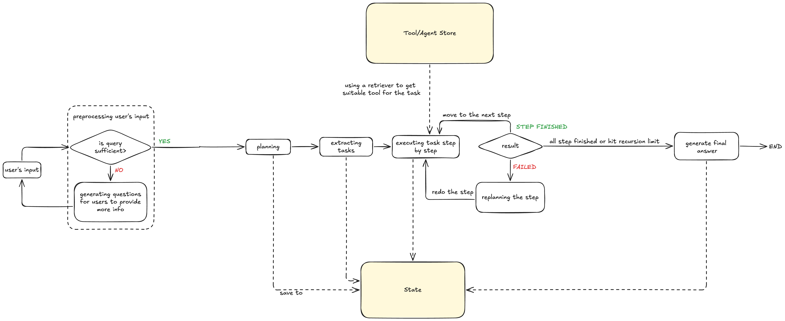
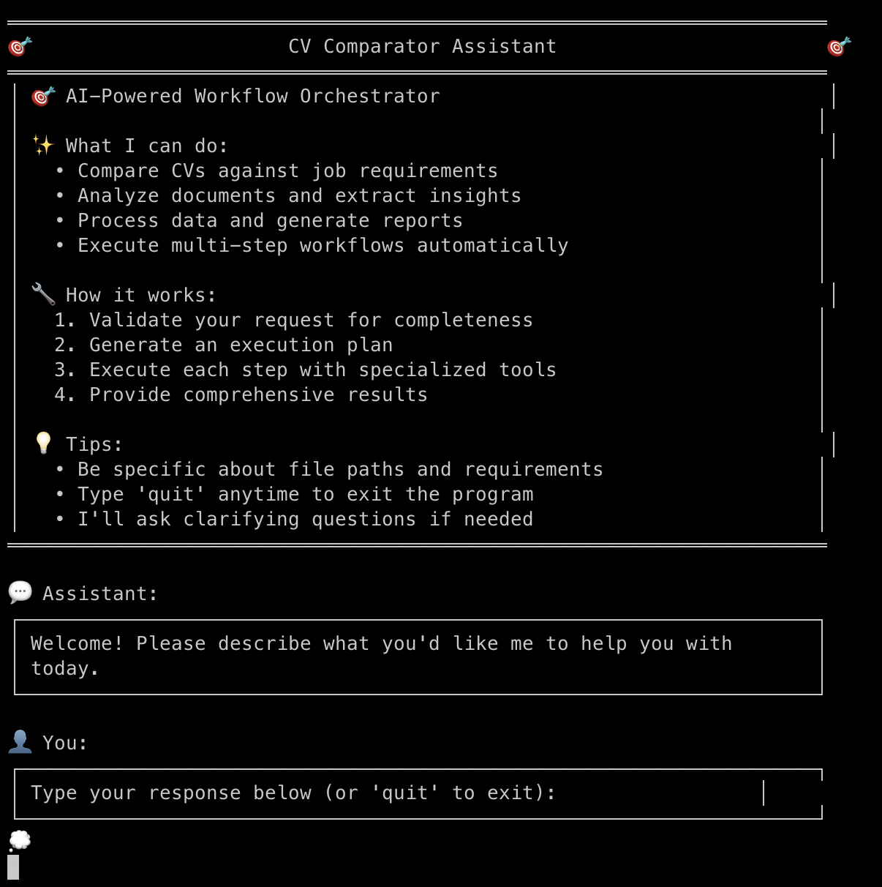

# CV Comparator

## Overview

This project implements an **AI-Powered Workflow Orchestrator** that specializes in CV comparison and analysis. The system features an intelligent Orchestrator agent capable of generating detailed execution plans and dynamically invoking specialized tools based on user queries.

To ensure high-quality outputs, the Orchestrator includes a query validation system that guides users to provide complete and actionable requests before generating execution plans.

## Architecture



### Core Workflow

The Orchestrator follows a systematic 4-step process:

1. **Query Validation & Enhancement**

   - Analyzes user input for completeness and clarity
   - Asks clarifying questions when information is missing
   - Ensures sufficient context for successful plan generation

2. **Plan Generation**

   - Creates a detailed, step-by-step execution plan
   - Breaks down complex objectives into manageable tasks
   - Defines dependencies and expected outputs for each step

3. **Dynamic Step Execution**

   - Executes each step using specialized tools from the Tool Store
      - Incorporating the results of the dependent step into the prompt. (For example, to analyze a job brief, it should incoporate the result of load txt file step to get the content of the file)
      - Selecting the appropriate tool from the Tool Store based on the task description.
   - Falls back to LLM reasoning when tools are unavailable
   - Implements failure recovery with step replanning and retry mechanisms

4. **Final Result Synthesis**
   - Aggregates results from all completed steps
   - Generates comprehensive final answer incorporating all insights
   - Provides actionable recommendations based on analysis

### Key Features

- **Interactive Query Refinement**: Conversational interface that guides users to provide complete requirements
- **Dynamic Tool Selection**: Automatically retrieves and applies the most appropriate tools for each step
- **Intelligent Error Recovery**: Replans and retries failed steps with improved approaches
- **Few-Shot Learning**: Uses examples to improve CV analysis accuracy and consistency
- **Multilingual Support**: Handles CVs in different languages (including Arabic, French, etc.)

## Quick Start

### 1. Installation

```bash
# Create virtual environment
python -m venv .venv
source .venv/bin/activate  # On Windows: .venv\Scripts\activate

# Install dependencies
pip install -r requirements.txt
```

### 2. Configuration

Create a `.env` file with your API keys:

```bash
# Use either OpenAI or Groq (or both)
OPENAI_API_KEY="your_openai_api_key"
GROQ_API_KEY="your_groq_api_key"
```

Configure your preferred model in `project.toml`:

- Set `provider` to either "openai" or "groq"
- Adjust `openai_default` or `groq_default` model names as needed

**Current Setup**: 
Currently, the project uses OpenAI for embeddings and Groq for LLM inference. For simplicity, a single general-purpose model is being used across all tasks, without fine-tuning or selecting specialized models for specific steps or tools.
In the future, it may be beneficial to explore model specialization (e.g., fine-tuned models or task-specific model selection) to improve performance and efficiency.

### 3. Usage

Launch the interactive orchestrator:

```bash
python main.py
```

The system provides a user-friendly chat interface:

**Note**: After entering an input, you have to press Enter key 2 to 3 times to send the message



### Example Interactions

Query:

```bash
I need to conduct a comprehensive CV analysis and comparison for a hiring process. Here are the specific requirements:

TASK OVERVIEW:
Compare all candidate CVs against a job brief to identify the most suitable candidates.

INPUT SOURCES:
- Job Brief: The file "brief2.txt" containing the job description and requirements
- CV Files: All .txt files located in the directory "./cvs" 

```


## Architecture Components

- **Orchestrator**: Main workflow coordination and plan generation
- **Tool Retriever**: Dynamic tool discovery and selection system
- **UI Manager**: Clean terminal interface with styled interactions
- **State Management**: Workflow state persistence and recovery


## Future Enhancements

- Redesign the Writer Agent, as the current implementation is not robust enough for real-world use.
- Implement a plan retriever to store and reuse successful workflows. This will allow the system to directly execute proven workflows when users make repeat requests, instead of rebuilding them from scratch.
- The current mechanism for incorporating history is quite basic. For example, if a previous step produces a large output (such as loading the contents of 50 files in a directory or a very large document), the workflow cannot handle it effectively. Attempting to insert everything into a single prompt quickly exceeds the context window.
A better solution is to introduce a Retrieval-Augmented Generation (RAG) system that transforms the results into smaller, manageable chunks and dynamically retrieves only the relevant portions when needed.
- Enable workflows to run tasks in parallel where beneficial. For example, when processing multiple files, the system should identify opportunities to execute steps concurrently to improve efficiency.
- Improve error handling within workflows. Currently, a failure in the middle of execution can cause vulnerabilities; better resilience and recovery mechanisms are needed.
- Expand the toolset to test the Orchestrator’s ability to handle diverse workflows. At present, the plan-generation step operates independently of tool availability, so methods should be introduced to better align planning with actual tool capabilities.
- Reduce occurrences of hallucinations during workflow generation. While rare, they still happen and should be further minimized.
