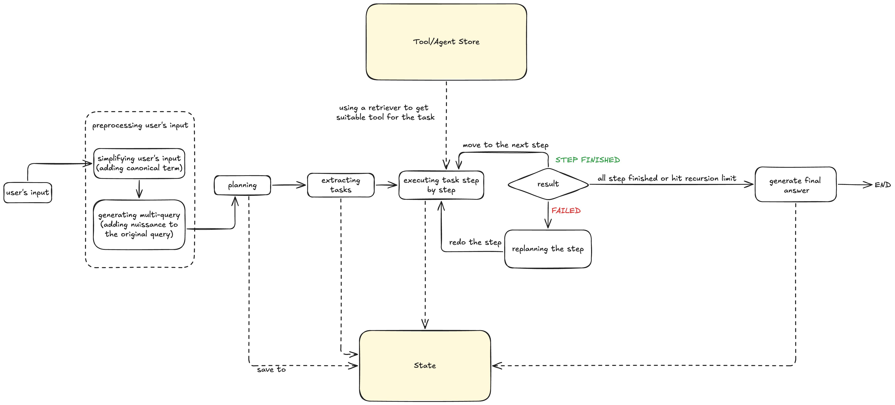

# CV Comparator

For this project, I focused on developing an Orchestrator agent—an agent capable of generating detailed plans and invoking the appropriate agents based on the user's query.

Orchestrator Agent's architecture that I implemented



## Quick Start

1. **Install dependencies**
```bash
pip install -r requirements.txt
```

2. **Set environment variables**
```bash
GROQ_API_KEY="your_groq_api_key"
# or
OPENAI_API_KEY="your_openai_api_key"
```
You could use either OpenAI model or Groq model by adding their key into a .env file and modifying `provider` and `groq_default` or `openai_default` to your preference


4. **Run the comparison**
You could run the example orchestrator workflow by running main.py

```bash
python main.py
```

